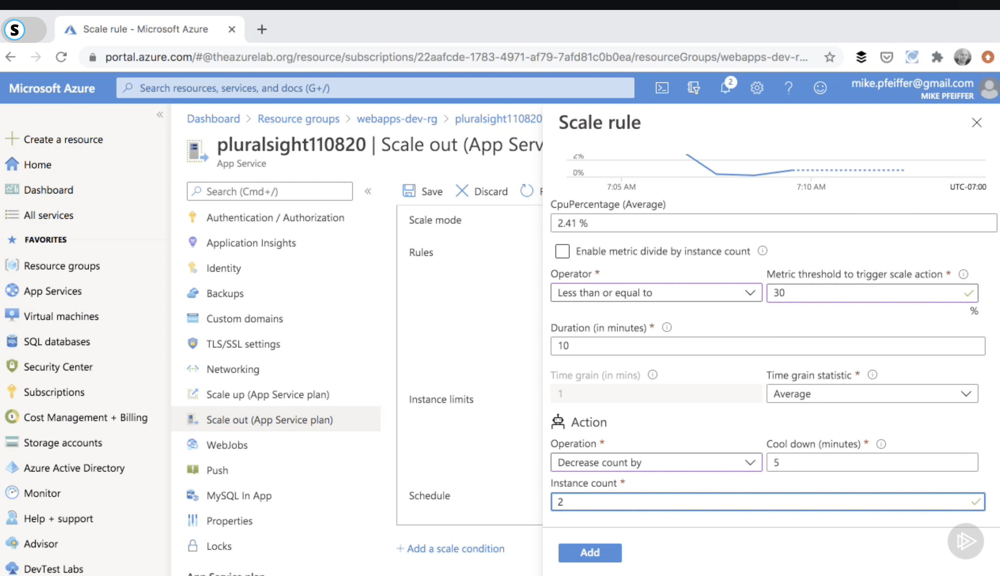

# App service

## App service isolated vs not isolated

## Non isolated App service plans

Not isolated App service plans are:
- F1 and D1 Free and Shared --> Run on shared infrastructure 
- B1, B2, B3 Basic type --> Lower traffic requirements, for development and testing, don't need advance autoscaling, Not for production
- S1, S2, S3 Standard type --> For Production, Price is based on number of instances you run, autoscaling, 
- P1v2, P2v2, P3v2 Premium v2 --> Designed to provide enhanced performance,
- P1v3, P2v3, P3v3 Premium v3 --> Upgraded premium plan

## Isolated App service environment (ASE)

- Fully isolated and dedicated environment for running webapp
- High scale and high utilization
- Isolation and secure network access
- Fine grain control over network traffic --> Network security group
- Apps on Vent can connect over VPM to on premises resources


## az cli deployment

```
az group create -n webapps-dev-rg -1 westus2

az appservice plan create --name webapps-dev-plan \
    --resource-group webapps-dev-rg \
    --sku s1 \
    --is-linux

az webapp create -g webapps-dev-rg \
    -p webapps-dev-plan \
    -n mp10344884 \
    --runtime "node | 10.14"

```

## az shell

```
# Create variables
$webappname "mywebapp$(Get-Random)" I
$rgname 'webapps3-dev-rg'
$location = 'westus2'

## Create a resource group
New-AzResourceGroup -Name $rgname -Location $location

## Create an App Service plan in S1 tier
New-AzAppServicePlan -Name $webappname -Location $location ResourceGroupName $rgname -Tier S1

New-AzWebApp -Name $webappname -Location $location -AppServicePlan $webappname -ResourceGroupName $rgname


## Create with resource template

To create it you need to create the resource and then use azure resource group deployment with template URL

```

```
New-AzResourceGroup -Name <resource-group-name> -Location <resource-group-location> #use this command when you need to create a new resource group for your deployment
New-AzResourceGroupDeployment -ResourceGroupName <resource-group-name> -TemplateUri https://raw.githubusercontent.com/Azure/azure-quickstart-templates/master/101-webapp-ba...
```

```
az group create --name resource-group-name> --location <resource-group-location> #use this command when you need to create a new resource group for your deployment
az group deployment create --resource-group <my-resource-group> --template-uri https://raw.githubusercontent.com/Azure/azure-quickstart-templates/master/101-webapp-basic-1:...
```

## App service configuration

### Securing webapp with SSL

link: https://app.pluralsight.com/course-player?clipId=3fd64730-532b-41e9-8a55-aa9c984250fb

- Securing a Domain with SSL/TLS binding certificate
    - Use at least Basic, Standard, Premium subscriptions or isolated plans
    - Generally better to use public certificates since it will be trusted by the client
    - Manage vs unmanaged certificates:
        -One can get certificate from Azure, mapped that to our domain, and it will be managed certificates
        - Unmanaged certificates will be: a private certificate, or the one you can buy from a public company, and you can upload those and bind them
        - You can enforce TLS and HTTPS functions

- How can you do it? Create a resource of type "App service domain"
    - This also creates a public DNS zone --> so we can map domain name record to the app service 
    
    How to do it? Go to the custom domain in the webapp. Write the domain name from App service domain that you created. Since Azure public DNS to make sure you own the domain.


    Then you need to create two records in App Service Domain:
    - Create a CNAME record in with Name reffering to the Alias name from Azure domain name

    - Second record will be the domain verification ID that you get from azure web app custom domain, and put that in the record as well in Azure App service domain with name ``` asuid.www ``` and type txt


    - Then just click on Add custom domain, after creating a record

- How to bind SSL after creating the custom domain name and records
 - In the webapp --> TLS/SSL settings
 - In the tab click on Private Key certificates. There are a few options like:
    - Import Azure Service --> Another Azure Services
    - Private (We can use this for Ramboll)
    - Import from key vault Certificate
    - Create App service manage certificates

The domain name is already selected --> Create certificate

Bind the certificate. It will be autoselected


The type is important
    - IP based SSL: one SSL is assigned to one IP.
    - SNI SSL (Serve name indication): multiple domain can refer to one domain 

### Database connection string

link:https://app.pluralsight.com/course-player?clipId=78528fa0-3ea5-498d-a325-e0150b7bebbb


### Enabling logging

Types of logging:

- Application logging: Log messages generated by our application code
- Web server logging: Raw http requests that are coming in
- Detailed error logging: See those in the browser that can help during the development. Only on windows
- Failed request tracing: Detail tracing information on failed request Only on Windows
- Deployment logging: Pushing code on app services.

### Scaling 

- Scaling horizontally means that --> making the server bigger --> (Scale up)
- Scaling vertically means that --> having multiple servers with a load balancer --> (Scale out)
- Scaling can be done based on CPU usage.
- Scaling can be done based on predictable usage patterns
- Opposite to scale out is scale in


- Auto scaling is only available in standard, premium and isolated pricing tiers

#### AutoScaling profile
- Capacity setting: minimum, max and default values for number of instances
- Rules regarding scheduling, receive notification 

- Scaling based on metrics --> IS when one can scale in and out the app based on rules like if the cpu metric tells that the utilization is 70% to scale out.
    -  While doing this there will be ``` Cool down (minutes) ``` which will tell you that it will take this much minutes for the system to come online and attach itself to the existing serves.
    - The rule will check the minutes mentioned in Duration for the CPU (or the metric) and then trigger the scale in or scale out.



- Important to have both scale out rule and scale in rule.